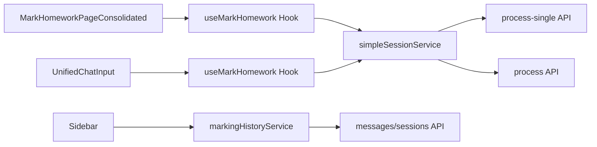

# Mark Homework API Flow Diagram

## Overview
This diagram shows the relationship between different API endpoints and their usage patterns in the IntelliMark system.

## API Endpoint Relationships

```mermaid
graph TD
    A[Frontend: Image Upload] --> B{First Time Upload?}
    B -->|Yes| C[/api/mark-homework/process-single]
    B -->|No| D[/api/mark-homework/process]
    
    E[Frontend: Chat Input] --> F{Has Session?}
    F -->|Yes| D
    F -->|No| C
    
    G[Admin Panel] --> H[/api/mark-homework/upload]
    I[Test Files] --> H
    C --> L[Create New Session]
    D --> M[Add to Existing Session]
    H --> N[Upload Only - No AI]
    
    L --> P[AI Response + Session ID]
    M --> Q[AI Response + Updated Session]
    N --> R[Image Stored + Session ID]
```

## Usage Patterns

### High Frequency (Primary User Flow)
- **`/api/mark-homework/process-single`**
  - Used by: `simpleSessionService.js:263`
  - Purpose: Initial image uploads
  - Creates: New session with AI response

### Medium Frequency (Follow-up Flow)
- **`/api/mark-homework/process`**
  - Used by: `simpleSessionService.js:423`
  - Purpose: Follow-up messages
  - Updates: Existing session

### Low Frequency (Specialized Use Cases)
- **`/api/mark-homework/upload`**
  - Used by: Admin panel, test files
  - Purpose: Image storage without AI
  - Creates: Session with user message only

- ~~**`/api/process`**~~ **REMOVED**
  - ~~Used by: External integrations~~
  - ~~Purpose: Generic processing~~
  - ~~Returns: Standardized response~~
  - **Status**: ❌ **OBSOLETE** - Removed due to no usage

## Frontend Integration Points



## Why Multiple Endpoints?

1. **Different Input Requirements**
   - `process-single`: No sessionId required
   - `process`: sessionId required
   - `upload`: No AI processing

2. **Different Business Logic**
   - `process-single`: Create new session
   - `process`: Update existing session
   - `upload`: Store image only

3. **Different Error Handling**
   - `process-single`: Handle new session creation errors
   - `process`: Handle session not found errors
   - `upload`: Handle storage errors

4. **Different Optimization Needs**
   - `process-single`: Optimized for first-time users
   - `process`: Optimized for follow-up interactions
   - `upload`: Optimized for bulk operations

## Monitoring and Usage

Each endpoint logs usage for monitoring:
- User agent identification
- Request frequency tracking
- Error pattern analysis
- Performance monitoring

This helps identify which endpoints are actually used and which might be candidates for removal or consolidation.
